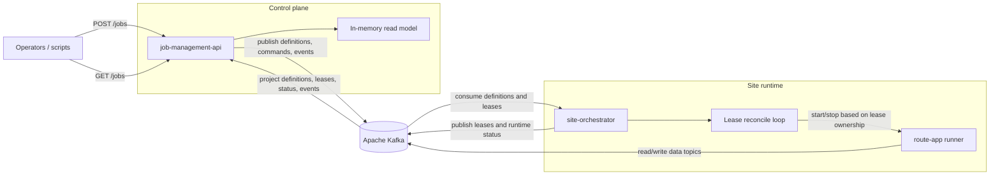
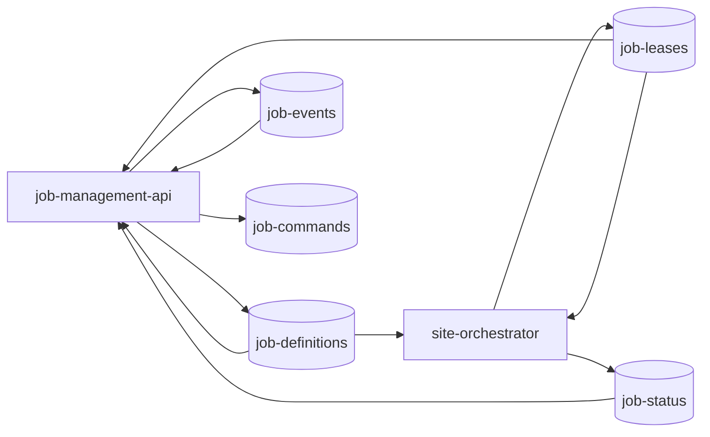

# streammux

`streammux` is a Kafka-backed control plane for multi-site stream processing jobs. It separates:

- a control API that accepts desired state
- a Kafka event backbone that distributes job state
- a site-local orchestrator that competes for leases and runs workers
- pluggable job runners, currently a Kafka Streams-based `route-app` runner

## Architecture

At runtime, `job-management-api` and one or more `site-orchestrator` instances communicate through Kafka. The API does not call orchestrators directly over HTTP. Instead, it publishes job definitions, commands, and events to Kafka, and both services build their current view from those topics.



## Kafka Topic Interconnections

These topic names are shared across modules and default to the values below:

- `job-definitions`
- `job-leases`
- `job-status`
- `job-events`
- `job-commands`

The current message flow is:



## Modules

- `job-contracts`: shared records, enums, topic names, validation, and the `JobRunner` SPI
- `job-management-api`: Spring Boot REST API that creates and updates jobs, publishes Kafka messages, and maintains an in-memory read model from Kafka listeners
- `site-orchestrator`: Spring Boot service that consumes job definitions and leases, decides lease ownership, and starts or stops local workers
- `job-runner-route-app`: current `JobRunner` implementation for `ROUTE_APP` jobs using Kafka Streams
- `integration-tests`: Testcontainers-based integration test module

## How The System Works

### 1. Desired state enters through the API

Clients create or update jobs through `job-management-api`, typically via `POST /jobs` or `PUT /jobs/{jobId}`. The API validates the payload, normalizes job metadata such as version and timestamps, then publishes:

- the `JobDefinition` to `job-definitions`
- audit-style `JobEvent` records to `job-events`
- command messages to `job-commands` for pause, resume, restart, and delete endpoints

### 2. The API builds a read model from Kafka

The API also consumes Kafka and stores the latest definitions, leases, statuses, and events in an in-memory `JobStateStore`. This is what powers `GET /jobs`, `GET /jobs/{jobId}/status`, `GET /jobs/{jobId}/lease`, and related endpoints.

### 3. Orchestrators compete for leases

Each `site-orchestrator` instance:

- consumes `job-definitions` and `job-leases`
- keeps a local in-memory state store
- runs a scheduled reconcile loop
- decides whether to claim, renew, release, or ignore a lease

Lease ownership is driven by desired state and lease expiry:

- `ACTIVE` jobs are eligible to run
- if no lease exists or the lease is expired, an orchestrator may claim it
- if the local orchestrator owns the lease, it renews it before expiry
- if the job is no longer `ACTIVE`, the orchestrator releases it

### 4. Workers run behind the orchestrator

The orchestrator resolves a `JobRunner` implementation for the job type. Today the only implementation is `RouteAppRunner`, which:

- builds a Kafka Streams topology from `routeAppConfig`
- uses `jobId` plus lease epoch as the Kafka Streams application id
- stops and restarts the stream when lease ownership changes

## `route-app` Filter Expressions

Each configured route applies its own `filterExpression` to the incoming payload. A single input record can match multiple routes and be forwarded to multiple output topics.

`filterExpression` now supports two matching modes:

- field comparison expressions using `==` or `!=`
- raw substring matching when the expression does not parse as a field comparison

### Field comparison syntax

Supported path styles:

- JSON Pointer style, such as `/message/type` or `/items/0/id`
- dotted path style, such as `message.type` or `items[0].id`

Supported operators:

- `==`
- `!=`

The value on the right side is parsed as JSON when possible. That means these are all valid:

```text
message.type == "ALARM"
severity == 3
active == true
/items/0/id != "abc"
```

If the right-hand value is not valid JSON, it is treated as a string. Single-quoted and double-quoted strings are both accepted.

Examples:

```text
message == "Message"
customer.name == 'alice'
/payload/source != "lab-a"
routes[0].enabled == true
```

### Matching semantics

Field comparisons are evaluated against the normalized payload:

- for JSON input, the payload is parsed as JSON directly
- for Protobuf input, the payload is first converted to JSON and then evaluated

Important behavior:

- if the path does not exist, the expression does not match
- blank or null `filterExpression` values do not match anything
- when the expression is not a recognized field comparison, matching falls back to substring search against the normalized payload text

Examples of substring fallback:

```text
Message
error_code=42
contains-bar
```

In those cases, the route matches when the normalized payload text contains the given string.

## Runtime Components

### `job-management-api`

- Default container port: `8080`
- Exposed by `docker-compose.yml` as `${JOB_MANAGEMENT_API_PORT:-8080}:8080`
- Provides `/jobs` endpoints and actuator endpoints

### `site-orchestrator`

- Connects to Kafka using `KAFKA_BOOTSTRAP_SERVERS`
- Uses `STREAMMUX_SITE_ID` and `STREAMMUX_INSTANCE_ID` as its identity
- Publishes lease and job status updates
- Is not exposed on a host port in `docker-compose.yml`

### Kafka

Kafka is an external dependency. The provided `docker-compose.yml` builds and runs the two Streammux services, but it does not start a Kafka broker. You must provide `KAFKA_BOOTSTRAP_SERVERS` through `.env` or the environment.

## Local Development

### Environment

Create a `.env` from `.env.example` and set at least:

```bash
KAFKA_BOOTSTRAP_SERVERS=localhost:9092
JOB_MANAGEMENT_API_PORT=8080
STREAMMUX_SITE_ID=site-a
STREAMMUX_INSTANCE_ID=orchestrator-1
STREAMMUX_ALLOWED_INPUT_TOPICS=net.optimum.monitoring.netscout.fixed.voicesip.json
STREAMMUX_ALLOWED_INPUT_TOPIC_PREFIXES=net.optimum.monitoring.
STREAMMUX_ALLOWED_OUTPUT_TOPIC_PREFIXES=lab.optimum.experimental.streamlens.streammux.
```

Topic restrictions are enforced by `job-management-api` during job create and update validation.
Use comma-separated values for exact allowlists and prefix-based namespace restrictions:

- `STREAMMUX_ALLOWED_INPUT_TOPICS`
- `STREAMMUX_ALLOWED_INPUT_TOPIC_PREFIXES`
- `STREAMMUX_ALLOWED_OUTPUT_TOPICS`
- `STREAMMUX_ALLOWED_OUTPUT_TOPIC_PREFIXES`

If both the exact list and prefix list are empty for a category, that category remains unrestricted.

### Start services

```bash
docker compose up --build
```

### Create a sample job

The repository includes `create-job.sh`, which posts a sample `ROUTE_APP` job to the API:

```bash
./create-job.sh
```

## Build

This is a Maven multi-module project targeting Java 21.

```bash
mvn package
```

## Current Implementation Notes

These details are important for understanding the current state of the project:

- `job-management-api` publishes to `job-commands`, but there is no command consumer in this repository yet
- operational control is currently driven primarily by `desiredState` on `JobDefinition` and by lease expiry/ownership
- `siteAffinity` and `priority` exist on `JobDefinition`, but the current lease logic does not use them
- both services keep their query/state views in memory
- `integration-tests` currently contains a placeholder failover test rather than a full end-to-end scenario

## Health And Observability

Both applications expose actuator endpoints including:

- `health`
- `info`
- `prometheus`
