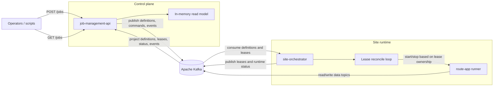
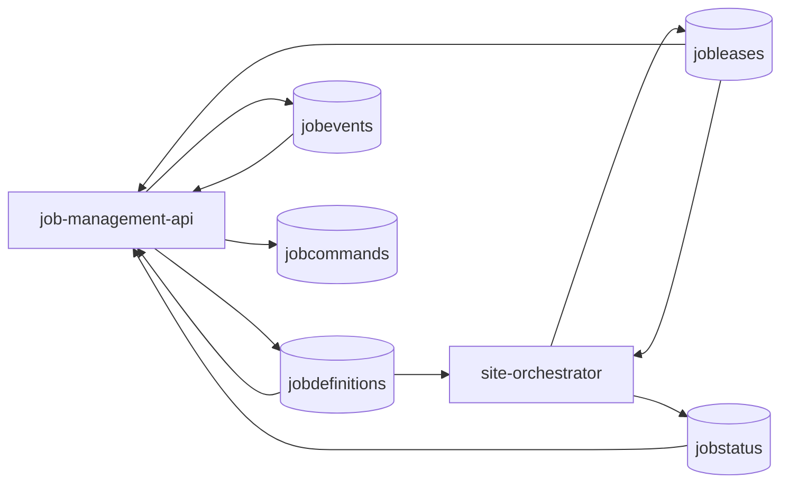

# streammux

`streammux` is a Kafka-backed control plane for multi-site stream processing jobs. It separates:

- a control API that accepts desired state
- a Kafka event backbone that distributes job state
- a site-local orchestrator that competes for leases and runs workers
- pluggable job runners, currently a Kafka Streams-based `route-app` runner

## Ownership

```
(c) Optimum 2026
Guillermo Schimmel
```

Proprietary — Optimum (Altice USA). All rights reserved.

## Architecture

At runtime, `job-management-api` and one or more `site-orchestrator` instances communicate through Kafka. The API does not call orchestrators directly over HTTP. Instead, it publishes job definitions, commands, and events to Kafka, and both services build their current view from those topics.

> Current behavior: each job will run in one worker at a time (the current lease owner).


```mermaid
flowchart LR
  Client[Operators / scripts]
  Kafka[(Apache Kafka)]

  subgraph ControlPlane[Control plane]
    API[job-management-api]
    APIStore[In-memory read model]
  end

  subgraph SiteRuntime[Site runtime]
    Orch[site-orchestrator]
    Lease[Lease reconcile loop]
    Runner[route-app runner]
  end

  Client -->|POST /jobs| API
  Client -->|GET /jobs| API

  API -->|publish definitions, commands, events| Kafka
  Kafka -->|project definitions, leases, status, events| API
  API --> APIStore

  Kafka -->|consume definitions and leases| Orch
  Orch --> Lease
  Lease -->|start/stop based on lease ownership| Runner
  Runner -->|read/write data topics| Kafka
  Orch -->|publish leases and runtime status| Kafka
```

## Kafka Topic Interconnections

These topic names are shared across modules and default to the values below:

- `net.optimum.experimental.streamlens.streammux.jobdefinitions`
- `net.optimum.experimental.streamlens.streammux.jobleases`
- `net.optimum.experimental.streamlens.streammux.jobstatus`
- `net.optimum.experimental.streamlens.streammux.jobevents`
- `net.optimum.experimental.streamlens.streammux.jobcommands`
- `net.optimum.experimental.streamlens.streammux.jobcatalog` (catalog API only)

The current message flow is:


```mermaid
flowchart LR
  API[job-management-api]
  ORCH[site-orchestrator]

  DEF[(jobdefinitions)]
  LEASE[(jobleases)]
  STATUS[(jobstatus)]
  EVENTS[(jobevents)]
  COMMANDS[(jobcommands)]

  API --> DEF
  API --> EVENTS
  API --> COMMANDS

  DEF --> API
  LEASE --> API
  STATUS --> API
  EVENTS --> API

  DEF --> ORCH
  LEASE --> ORCH

  ORCH --> LEASE
  ORCH --> STATUS
```

## Modules

- `job-contracts`: shared records, enums, topic names, validation, and the `JobRunner` SPI
- `job-management-api`: Spring Boot REST API that creates and updates jobs, publishes Kafka messages, and maintains an in-memory read model from Kafka listeners
- `site-orchestrator`: Spring Boot service that consumes job definitions and leases, decides lease ownership, and starts or stops local workers
- `runners/`: Maven modules for pluggable `JobRunner` implementations (artifact IDs remain `job-runner-*`)
  - `runners/job-runner-route-app`: `ROUTE_APP` jobs using Kafka Streams
  - `runners/job-runner-random-sampler`: `RANDOM_SAMPLER` (sampling / tests)
  - `runners/job-runner-alarms-to-ztr`: `ALARMS_TO_ZTR` (JSON alarm normalization via inline mapping/filter templates)
- `integration-tests`: Testcontainers-based integration test module

## How The System Works

Streammux is **100% API-managed**: operators and automation interact only through the job management REST API (and the catalog API for templates). There is no supported workflow to configure runners by shell access on orchestrator hosts.

### 1. Desired state enters through the API

Clients create or update jobs through `job-management-api`, typically via `POST /jobs` or `PUT /jobs/{jobId}`. The API validates the payload, normalizes job metadata such as version and timestamps, then publishes:

- the `JobDefinition` to `net.optimum.experimental.streamlens.streammux.jobdefinitions`
- audit-style `JobEvent` records to `net.optimum.experimental.streamlens.streammux.jobevents`
- command messages to `net.optimum.experimental.streamlens.streammux.jobcommands` for pause, resume, restart, and delete endpoints

### 2. The API builds a read model from Kafka

The API also consumes Kafka and stores the latest definitions, leases, statuses, and events in an in-memory `JobStateStore`. This is what powers `GET /jobs`, `GET /jobs/{jobId}/status`, `GET /jobs/{jobId}/lease`, and related endpoints.

### 3. Orchestrators compete for leases

Each `site-orchestrator` instance:

- consumes `net.optimum.experimental.streamlens.streammux.jobdefinitions` and `net.optimum.experimental.streamlens.streammux.jobleases`
- keeps a local in-memory state store
- runs a scheduled reconcile loop
- decides whether to claim, renew, release, or ignore a lease

Lease ownership is driven by desired state and lease expiry:

- `ACTIVE` jobs are eligible to run
- if no lease exists or the lease is expired, an orchestrator may claim it
- if the local orchestrator owns the lease, it renews it before expiry
- if the job is no longer `ACTIVE`, the orchestrator releases it

> Current behavior: each job will run in one worker at a time (the current lease owner).

### 4. Workers run behind the orchestrator

The orchestrator resolves a `JobRunner` implementation for the job type. Today the only implementation is `RouteAppRunner`, which:

- builds a Kafka Streams topology from `routeAppConfig`
- uses a stable Kafka Streams application id of `streammux-{jobId}` (one consumer group per job)
- stops and restarts the stream when lease ownership changes

## `route-app` Filter Expressions

Each configured route applies its own `filterExpression` to the incoming payload. A single input record can match multiple routes and be forwarded to multiple output topics.

`filterExpression` supports three matching modes:

- **Compound boolean expressions** using `&&`, `||`, `!`, and parentheses
- **Field comparison expressions** using `==`, `!=`, `in`, and `not in`
- **Raw substring matching** when the expression does not parse as a filter expression

### Compound boolean syntax

Combine field comparisons with boolean operators:

```text
eventType == "NEW" && subsystem != "FTTH-AGORA-SNMP"
eventType == "NEW" && !(subsystem == "FTTH-AGORA-SNMP" && specificProblem in ["Loss of signal for ONUi", "Receive dying-gasp of ONUi"])
severity == "MAJOR" || severity == "CRITICAL"
```

Operator precedence: `!` binds tighter than `&&`, which binds tighter than `||`. Use parentheses when in doubt.

### Field comparison syntax

Supported path styles:

- JSON Pointer style, such as `/message/type` or `/items/0/id`
- dotted path style, such as `message.type` or `items[0].id`

Supported operators:

- `==`
- `!=`
- `in`
- `not in`

Membership examples:

```text
specificProblem in ["Loss of signal for ONUi", "Receive dying-gasp of ONUi"]
subsystem not in ["FTTH-AGORA-SNMP", "HFC-CM-SNMP"]
```

The value on the right side is parsed as JSON when possible. That means these are all valid:

```text
message.type == "ALARM"
severity == 3
active == true
/items/0/id != "abc"
```

If the right-hand value is not valid JSON, it is treated as a string. Single-quoted and double-quoted strings are both accepted.

Examples:

```text
message == "Message"
customer.name == 'alice'
/payload/source != "lab-a"
routes[0].enabled == true
```

### Matching semantics

Field comparisons are evaluated against the normalized payload:

- for JSON input, the payload is parsed as JSON directly
- for Protobuf input, the payload is first converted to JSON and then evaluated

Important behavior:

- if the path does not exist, the expression does not match
- blank or null `filterExpression` values do not match anything
- when the expression does not parse as a filter expression, matching falls back to substring search against the normalized payload text

Examples of substring fallback:

```text
Message
error_code=42
contains-bar
```

In those cases, the route matches when the normalized payload text contains the given string.

## Runtime Components

### `job-management-api`

- Default container port: `8080`
- Exposed by `docker-compose.yml` as `${JOB_MANAGEMENT_API_PORT:-8080}:8080`
- Provides `/jobs` endpoints and actuator endpoints

### `site-orchestrator`

- Connects to Kafka using `KAFKA_BOOTSTRAP_SERVERS`
- Uses `STREAMMUX_SITE_ID` and `STREAMMUX_INSTANCE_ID` as its identity
- Publishes lease and job status updates
- Is not exposed on a host port in `docker-compose.yml`

### Kafka

Kafka is an external dependency. The provided `docker-compose.yml` builds and runs the two Streammux services, but it does not start a Kafka broker. You must provide `KAFKA_BOOTSTRAP_SERVERS` through `.env` or the environment.

## Local Development

### Environment

Create a `.env` from `.env.example` and set at least:

```bash
KAFKA_BOOTSTRAP_SERVERS=localhost:9092
JOB_MANAGEMENT_API_PORT=8080
STREAMMUX_SITE_ID=site-a
STREAMMUX_INSTANCE_ID=orchestrator-1
STREAMMUX_ALLOWED_INPUT_TOPIC_PREFIXES=com.optimum.,net.optimum.,gcp.optimum.
STREAMMUX_ALLOWED_OUTPUT_TOPIC_PREFIXES=net.optimum.
```

Topic restrictions are enforced by `job-management-api` during job create and update validation.
The same validator is exposed as a dry-run at `POST /jobs/validate`, and its JSON Schema is served at `GET /jobs/schema` so the web UI editor and other clients can lint payloads against the same shape.
Use comma-separated values for exact allowlists and prefix-based namespace restrictions:

- `STREAMMUX_ALLOWED_INPUT_TOPICS`
- `STREAMMUX_ALLOWED_INPUT_TOPIC_PREFIXES`
- `STREAMMUX_ALLOWED_OUTPUT_TOPICS`
- `STREAMMUX_ALLOWED_OUTPUT_TOPIC_PREFIXES`

If both the exact list and prefix list are empty for a category, that category remains unrestricted.

### Start services

```bash
docker compose up --build
```

### Create a sample job

The repository includes `create-job.sh`, which posts a sample `ROUTE_APP` job to the API:

```bash
./create-job.sh
```

For an `ALARMS_TO_ZTR` job use `create-alarms-to-ztr-job.sh`, which posts a job that
carries its mapping and filter inline in the job definition (no sidecar files):

```bash
./create-alarms-to-ztr-job.sh
```

See [runners/job-runner-alarms-to-ztr](runners/job-runner-alarms-to-ztr) for the runner
itself. The config shape lives in
[`AlarmsToZtrConfig`](job-contracts/src/main/java/io/github/guillebot/streammux/contracts/config/AlarmsToZtrConfig.java):
a named map of JSON mapping templates (same shape as the output message, with `$input.<path>`
references and `{"$input": "...", "$map": {...}}` value maps) plus an optional `filter`
with ordered rules (`eq`, `ne`/`not_eq`, `in`, `not_in`, `regex`, `exists`) where each rule
may override which mapping is applied.

## Documentation

- [docs/api.md](docs/api.md) — **100% API-managed** control plane, complete OpenAPI reference, curl examples
- [docs/usage.md](docs/usage.md) — quick endpoint index, helper scripts, health endpoints
- [docs/openapi.json](docs/openapi.json) — checked-in OpenAPI snapshot for job-management-api

## Build

This is a Maven multi-module project targeting Java 21.

```bash
mvn package
```

## Current Implementation Notes

These details are important for understanding the current state of the project:

- `job-management-api` publishes to `net.optimum.experimental.streamlens.streammux.jobcommands`, but there is no command consumer in this repository yet
- operational control is currently driven primarily by `desiredState` on `JobDefinition` and by lease expiry/ownership
- `siteAffinity` and `priority` exist on `JobDefinition`, but the current lease logic does not use them
- both services keep their query/state views in memory
- `integration-tests` currently contains a placeholder failover test rather than a full end-to-end scenario

## Health And Observability

**job-management-api** and **site-orchestrator** each expose unauthenticated actuator endpoints on container port **8080**:

- `/actuator/health` — liveness/readiness (Compose uses `curl` healthchecks)
- `/actuator/info` — build info
- `/actuator/prometheus` — Micrometer export including custom `streammux_*` job and platform metrics

On kstreams production hosts, **otelcol-contrib** scrapes both services and forwards metrics to Mimir and container logs to Loki. Set `SPRING_PROFILES_ACTIVE=prod` for JSON logging with `siteId`, `instanceId`, `jobId`, and `action` fields.

Full pipeline, metric catalog, Grafana dashboards, and verification commands: **[docs/observability.md](docs/observability.md)**.
