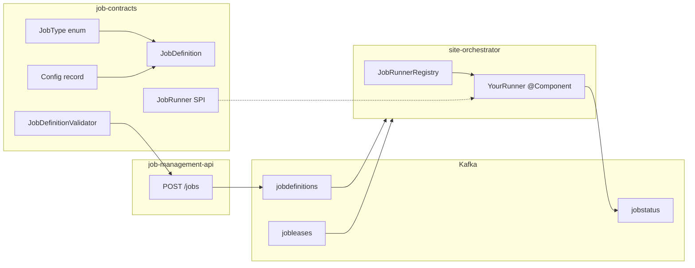

# Developer guidelines

Guidance for contributors extending Streammux: building locally, following repo conventions, and adding new **job types** (runners).

For session handoff context (agents, locked Kafka naming, environment tables), see [AGENTS.md](../AGENTS.md). For the full step-by-step runner checklist, see [AGENT-MODULE-HOWTO.md](../AGENT-MODULE-HOWTO.md).

---

## Before you change code

1. Read [overview.md](overview.md) and [architecture.md](architecture.md) — the control plane is **Kafka-first**; HTTP is how operators write desired state, not how orchestrators are driven directly.
2. Skim [job-types.md](job-types.md) for existing runner config shapes.
3. Run a baseline build: `mvn package` from the repo root (Java 21).

---

## Repository layout

| Path | When you touch it |
| ---- | ----------------- |
| `job-contracts` | New `JobType`, config records, validation, serde, SPI |
| `runners/job-runner-*` | Runner implementation (Kafka Streams or custom runtime) |
| `site-orchestrator` | Add Maven dependency on new runner module (no Java registry code) |
| `job-management-api` | Rarely — validation lives in contracts; API calls `JobDefinitionValidator` |
| `integration-tests` | End-to-end tests; add runner artifact to `pom.xml` |
| `web-ui/` | Optional operator UX (types, job builder) — separate npm build |
| `Dockerfile.orchestrator`, `Dockerfile.api` | `COPY` lines for new runner paths |
| Root `pom.xml` | `<module>runners/job-runner-<name></module>` |

The Maven reactor does **not** include `web-ui` or `job-catalog-api`. Those ship via Docker or their own npm scripts.

---

## Build and test

```bash
# Full Java reactor
mvn package

# Narrow scope while iterating on a runner
mvn -pl job-contracts,site-orchestrator,runners/job-runner-<name> -am test

# Single module by artifactId
mvn -pl :job-runner-<name> test
```

**Kafka Streams runners:** use `kafka-streams-test-utils` in module tests (see `runners/job-runner-route-app`).

**Integration tests:** Testcontainers scenarios live under `integration-tests/`; coverage is still growing — add a scenario when your runner introduces new reconcile behavior.

**Web UI:** `cd web-ui && npm install && npm run dev` (management API must be reachable for live data).

**Docker:** `docker compose -f docker-compose.dev.yml up --build` requires `.env` with `KAFKA_BOOTSTRAP_SERVERS`. Streammux does not start Kafka for you.

---

## Coding conventions

- **Minimal diffs.** Match existing naming, package layout (`io.github.guillebot.streammux.<module>`), and Spring stereotypes (`@Component` on runners and topology factories).
- **Contracts are the source of truth.** API JSON, Kafka serde, orchestrator, and runners must agree on `JobDefinition` shape. Extend the record in `job-contracts`, then fix every `new JobDefinition(...)` call site (compiler will surface most misses).
- **Validation in contracts.** Add type-specific checks to `JobDefinitionValidator`. Run input/output topic names through `TopicValidationPolicy` when the config references Kafka topics.
- **Idempotent lifecycle.** Runners must tolerate repeated `start`/`stop` calls from the orchestrator reconcile loop. Existing runners call `stop(jobId)` at the beginning of `start`.
- **Lease epoch in runtime identity.** Include `leaseEpoch` in Kafka Streams `application.id` (or equivalent) so a new lease owner does not reuse committed state from a previous owner. Use `KafkaStreamsApplicationIds.applicationId(jobId, leaseEpoch)` — all runner groups are prefixed `streammux-`:

```java
properties.put(StreamsConfig.APPLICATION_ID_CONFIG, KafkaStreamsApplicationIds.applicationId(definition.jobId(), leaseEpoch));
```

- **One runner per job type.** `JobRunnerRegistry` resolves with `findFirst()` on Spring-injected beans. Exactly one `supports()` implementation may match a given `jobType`.

---

## Control plane vs data plane

| Plane | What it is | Examples |
| ----- | ---------- | -------- |
| **Control plane** | Streammux app topics and HTTP API | `net.optimum.experimental.streamlens.streammux.jobdefinitions`, leases, status |
| **Data plane** | Topics your job reads/writes | `net.optimum.*`, `com.optimum.*`, job-specific routes |

Do not conflate the app topic prefix with job input/output allowlists. Production output allowlist is `net.optimum.` — see [AGENTS.md](../AGENTS.md) and `.cursor/rules/prod-kafka.mdc`.

Job definitions carry their own `streamProperties.bootstrap.servers` for the **data plane** cluster; platform services use `KAFKA_BOOTSTRAP_SERVERS` for the control plane.

---

## Adding a new job type (runner)

A **job type** is a value of `JobType` plus a dedicated config block on `JobDefinition` (e.g. `routeAppConfig`, `randomSamplerConfig`). A **runner** is a Spring `@Component` implementing `JobRunner` that executes jobs of that type when the local orchestrator holds the lease.

Streammux does **not** load external JAR plugins at runtime. New runners are **in-tree Maven modules** wired into `site-orchestrator`'s classpath.

### Architecture



### The `JobRunner` contract

```java
public interface JobRunner {
    boolean supports(JobDefinition jobDefinition);
    void start(JobDefinition jobDefinition, long leaseEpoch);
    void stop(String jobId);
    JobRuntimeStatus status(String jobId);
}
```

| Method | Expectation |
| ------ | ----------- |
| `supports` | Return `true` only for your `JobType`. Must not overlap other runners. |
| `start` | Begin local work for `jobId`. Stop any existing instance first. Use `leaseEpoch` in consumer group / Streams app id. |
| `stop` | Release threads, streams, clients. Safe if already stopped. |
| `status` | Non-null `JobRuntimeStatus` for orchestrator publishing to `jobstatus`. |

The orchestrator never calls runners over HTTP — it invokes this SPI in-process after winning a lease ([`OrchestratorService`](../site-orchestrator/src/main/java/io/github/guillebot/streammux/orchestrator/service/OrchestratorService.java), [`JobRunnerRegistry`](../site-orchestrator/src/main/java/io/github/guillebot/streammux/orchestrator/runner/JobRunnerRegistry.java)).

### Step-by-step (summary)

| Step | Action |
| ---- | ------ |
| 1 | Add `JobType` constant in `job-contracts/.../JobType.java`. |
| 2 | Add config record under `job-contracts/.../config/` (immutable `record`, camelCase JSON fields). |
| 3 | Extend `JobDefinition` with the new config component; update all constructors / call sites. |
| 4 | Extend `JobDefinitionValidator` + unit tests in `job-contracts`. |
| 5 | Create `runners/job-runner-<name>/` (copy `job-runner-random-sampler` for a minimal Streams example). |
| 6 | Implement `@Component` `JobRunner` + topology factory (if Streams). |
| 7 | Register module in root `pom.xml`; add dependency in `site-orchestrator/pom.xml`. |
| 8 | Update `Dockerfile.orchestrator` and `Dockerfile.api` `COPY` paths. |
| 9 | Add dependency to `integration-tests/pom.xml` if the module ships in this repo. |
| 10 | Verify: `mvn -pl site-orchestrator,runners/job-runner-<name> -am test`, then `POST /jobs` with sample payload. |

Detailed checklist, Docker notes, and verification commands: [AGENT-MODULE-HOWTO.md](../AGENT-MODULE-HOWTO.md).

### Kafka Streams pattern (recommended)

Existing runners split responsibilities:

1. **Topology factory** (`@Component`) — builds `Topology` and `Properties` from `JobDefinition`.
2. **Runner class** — implements `JobRunner`, owns lifecycle.
3. **`KafkaStreamsRunnerSupport`** — in-module helper for register/stop/status/lag ([`runners/job-runner-random-sampler/.../KafkaStreamsRunnerSupport.java`](../runners/job-runner-random-sampler/src/main/java/io/github/guillebot/streammux/runner/support/KafkaStreamsRunnerSupport.java)).

Reference implementations:

| Job type | Module | Complexity |
| -------- | ------ | ---------- |
| `RANDOM_SAMPLER` | `runners/job-runner-random-sampler` | Minimal single-route Streams topology |
| `ROUTE_APP` | `runners/job-runner-route-app` | Multi-route filters, JSON/Protobuf normalization |
| `ALARMS_TO_ZTR` | `runners/job-runner-alarms-to-ztr` | Mapping templates + ordered filter rules |

### Non–Kafka Streams runners

The SPI is transport-agnostic. Implement the same four methods using threads, Kafka clients, Flink jobs, or subprocesses — map your runtime lifecycle to `start`/`stop` and report health via `JobRuntimeStatus`.

### Optional follow-ups

| Area | Files / notes |
| ---- | ------------- |
| **Web job builder** | `web-ui/src/types.ts`, `web-ui/src/jobBuilderOptions.ts`, `web-ui/src/JobBuilder.tsx` |
| **Sample script** | Root `create-<type>-job.sh` (see `create-job.sh`, `create-alarms-to-ztr-job.sh`) |
| **Catalog templates** | `job-catalog-api` + web UI catalog page |
| **OpenAPI / MCP** | Schemas come from job-management-api springdoc; refresh [docs/openapi.json](openapi.json) if you publish doc snapshots |
| **Operator docs** | Add a section to [job-types.md](job-types.md) describing config fields and examples |

UI and catalog changes are **not** required for a runner to work — operators can `POST /jobs` with raw JSON.

---

## Example: skeleton for `MY_TRANSFORM`

**1. Contracts** — enum value, config record, validator branch.

**2. Runner module** — `MyTransformRunner.java`:

```java
@Component
public class MyTransformRunner implements JobRunner {
    private final MyTransformTopologyFactory topologyFactory;
    private final KafkaStreamsRunnerSupport streamsSupport = new KafkaStreamsRunnerSupport();

    @Override
    public boolean supports(JobDefinition d) {
        return d.jobType() == JobType.MY_TRANSFORM;
    }

    @Override
    public void start(JobDefinition d, long leaseEpoch) {
        stop(d.jobId());
        KafkaStreams streams = new KafkaStreams(
            topologyFactory.build(d),
            topologyFactory.properties(d, leaseEpoch));
        streamsSupport.register(d.jobId(), streams);
        streams.start();
    }

    @Override
    public void stop(String jobId) { streamsSupport.stop(jobId); }

    @Override
    public JobRuntimeStatus status(String jobId) {
        return streamsSupport.status(jobId, "my-transform");
    }
}
```

**3. Sample job payload:**

```json
{
  "jobId": "my-transform-1",
  "jobType": "MY_TRANSFORM",
  "desiredState": "ACTIVE",
  "myTransformConfig": {
    "inputTopic": "net.optimum.example.input",
    "outputTopic": "net.optimum.example.output",
    "streamProperties": {
      "bootstrap.servers": "kafka:9092",
      "auto.offset.reset": "earliest"
    }
  }
}
```

**4. Wire** `site-orchestrator/pom.xml`, root reactor, Dockerfiles, run tests, post job, confirm orchestrator logs show start and `jobstatus` updates.

---

## What not to rely on (yet)

- **`jobcommands` topic** — API publishes commands; no in-repo consumer drives runner lifecycle. Use `desiredState` and leases.
- **`siteAffinity` / `priority`** — fields exist on definitions but lease logic does not use them today.
- **In-memory read models** — API and orchestrator replay from Kafka on restart; expect brief empty views after process start.

See [overview.md § Current limitations](overview.md#current-limitations).

---

## Documentation map

| Doc | Purpose |
| --- | ------- |
| [developer-guidelines.md](developer-guidelines.md) | This file — contributor workflow |
| [AGENT-MODULE-HOWTO.md](../AGENT-MODULE-HOWTO.md) | Detailed runner module checklist |
| [AGENTS.md](../AGENTS.md) | Agent/session context, locked prod Kafka settings |
| [job-types.md](job-types.md) | Operator-facing config reference per type |
| [deployment.md](deployment.md) | Env vars, images, allowlists |

Developer-only files are excluded from the in-app Documentation page (`/#/docs`); operator guides live under `docs/` only.
